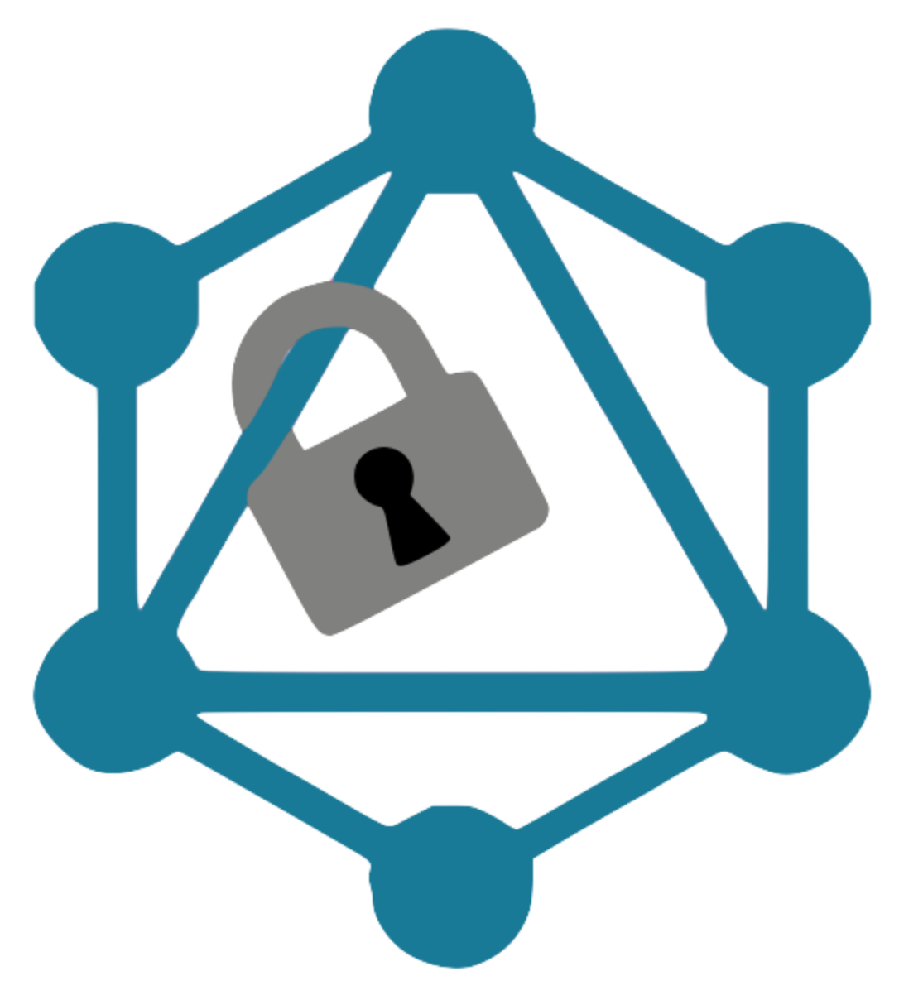

<h1 align="center">
  
  <br>GraphQLock</br>
</h1>

GraphQLock is a server-side NPM middleware library package that provides a layer of security for Express GraphQL servers by using user defined roles and operations to authorize queries that access and mutate data stored in a database.

For a seamless user experience, GraphQLock utilizes access and refresh tokens for user authentication and authorization. Because a MongoDB model is used to store the refresh tokens, you will need to have a MongoDB Atlas [account](https://www.mongodb.com/atlas/database) to connect the database to the middleware.

## Features

- User defined role based authorization
- Easily modifiable permissions
- Simple setup and integration
- Utilization of refresh tokens for convenience and security
- Cross platform compatibility

## Setup

#### Installation:
To integrate GraphQLock with your existing application, install the following NPM package:
```
npm i graphqlock
```
Install dependencies:
```
npm i
```

#### Add MongoDB connection string to .env file:
Add a `.env` file in the **root directory** of your application. In the **.env** file, add a MongoDB connection string to `MONGO_URI` to start a connection with your MongoDB database:
```
MONGO_URI=<CONNECTION_STRING_WITH_PASSWORD>
```

#### Defining user roles and operations: 
Add a `graphqlock.json` file in the **root directory** of your application. This is the configuration file for defining user roles and permissions.

Example configuration file format:
```
{
  "admin": {
    "query": ["."], 
    "mutation": ["."]
  },
  "contractor": {
    "query": ["people"], 
    "mutation": ["addCharacter", "updateCharacter"]
  },
  "read_only": {
    "query": ["."]
  }
}
```
The file format is organized by roles => operations => fields. The user defines a role and specifies what operations and fields each role has access to. The dot `.` signifies that all fields within the operations are available to a role.

#### Requiring in functions to the application:
There are three functions that are utilized in the NPM package, which will need to be required in where applicable.
- `loginLink`: This middleware function will need to be inserted into the authorization route of your application. When a user logs in to your application, you will need to set `res.locals.username` and `res.locals.role` to pass the username and role to the **loginLink** middleware. This middleware will generate access and refresh tokens that will be stored in cookies and used for user authorization. 

- `createSecrets`: This function will need to be required in and invoked in your application in order to generate the secrets used during the creation of JSON Web Tokens. The secrets for the access and refresh tokens will be encryted and stored in the **.env** file.

- `validateToken`: This middleware function will need to be inserted into the GraphQL route of your application. When a user makes a GraphQL query, this query will be passed to the **validateToken** function, which will verify the presence of an access token.

If an access token exists, the query operation will be validated against the operation and role permissions set from the `graphqlock.json` configuration file. If the user is authorized to make the query, the query will be passed to the GraphQL middleware. If authorization fails, the user will receive an error. 

If an access token does not exist, the middleware will check for a refresh token. If the refresh token is not found, the user will receive an error. Otherwise, the refresh token will be used to generate a new access token, which will then follow the same validation steps outlined above.

Examples of requiring in and using the middleware functions:
```
const { loginLink } = require('graphqlock');

router.post('/login',
  userController.verifylogin,
  userController.setCookieANDToken,
  loginLink,
  (req, res) => {
    return res.status(200).json(res.locals);
  }
);
```

```
const { createSecrets, validateToken } = require('graphqlock');
createSecrets();

app.use('/graphql', validateToken, graphqlHTTP({
  schema,
  graphiql: true
}));
```

## Contribute

If you would like to contribute in improving the functionality of GraphQLock, please submit your ideas and/or bug fixes to our team by forking the repo and submitting your changes via a pull request. 

Here are some new features we would like to implement:
- Having a GUI to set user role and permissions
- Storing denied GraphQL queries for security purposes
- Adding a central database to store refresh tokens

## To Learn More

- Visit the GraphQLock [website]()
- Read the GraphQLock [Medium article]()

## Contributors

- Charlie Huang [@CharlieHuangDev](https://github.com/CharlieHuangDev)
- Drake Williams [@DRWilliams527](https://github.com/DRWilliams527)
- Jiwon Chung [@jchung07](https://github.com/jchung07)
- Phoenix Newman [@phoeN24](https://github.com/phoeN24)